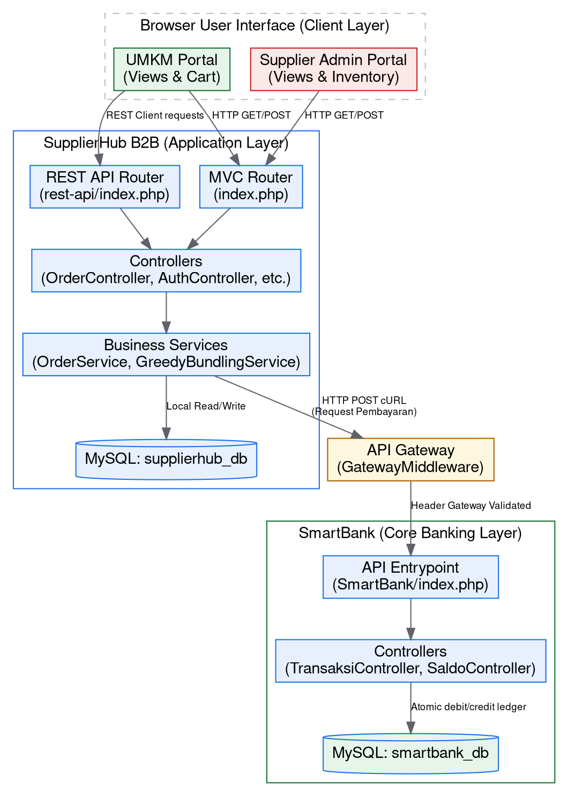
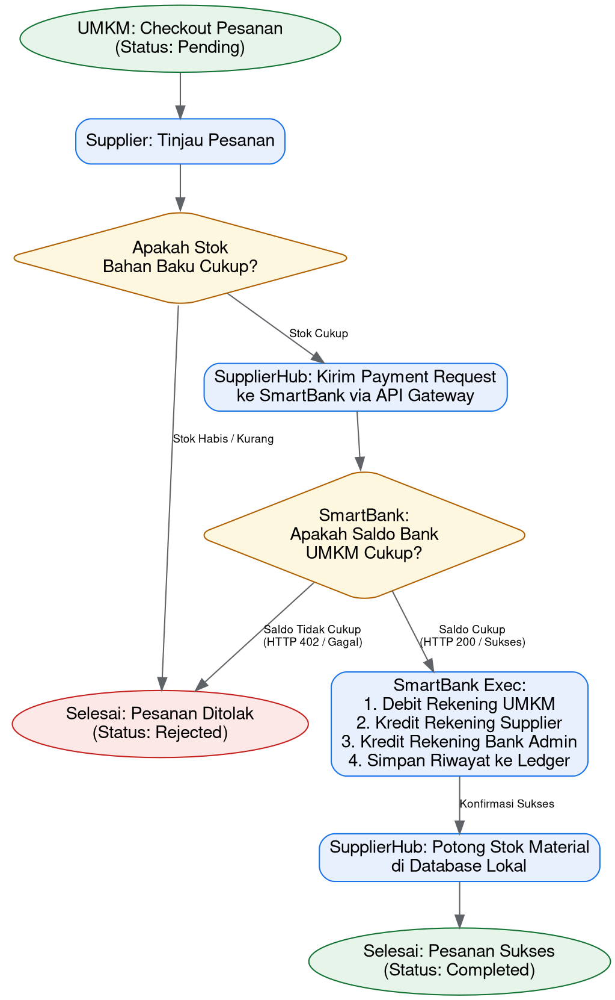
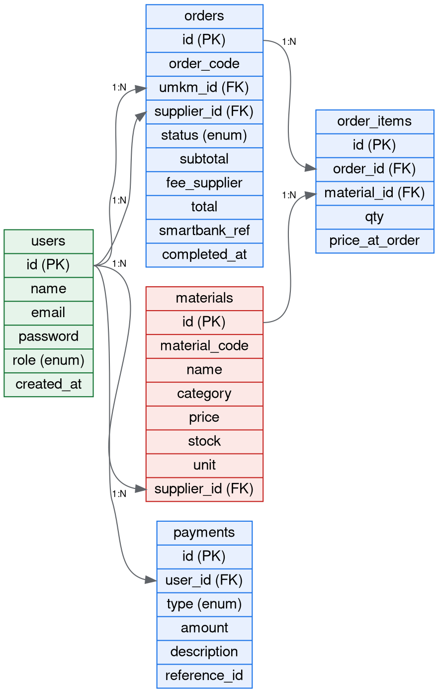
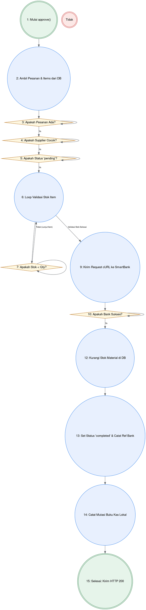

# DOKUMEN DESAIN SISTEM
## SKEMA TUGAS BESAR MATA KULIAH REKAYASA PERANGKAT LUNAK 2 (RPL 2)
**Dosen Pengampu:** M. Yusril Helmi Setyawan, S.Kom., M.Kom.  
**Sistem Aplikasi:** Ekosistem B2B SupplierHub & SmartBank Core Banking  

---

### 1. Deskripsi Aplikasi
**SupplierHub B2B** adalah sebuah platform e-procurement B2B yang dirancang khusus untuk memfasilitasi rantai pasok antara UMKM (Usaha Mikro, Kecil, dan Menengah) sebagai manufaktur/pembeli dengan Supplier sebagai penyedia bahan baku. Aplikasi ini terintegrasi secara langsung dengan **SmartBank** (aplikasi Core Banking kelompok mitra) melalui **API Gateway** bersama untuk memproses seluruh transaksi pembayaran secara nontunai secara terenkripsi dan otomatis.

*   **Tujuan Aplikasi:** Mengotomatiskan alur pengadaan bahan baku bagi pelaku usaha, menjamin transparansi pencatatan keuangan melalui buku besar terdistribusi, serta mengefisiensikan penghitungan rekomendasi paket belanja optimal.
*   **Peran dalam Ekosistem:**
    1.  **SupplierHub Web & REST API:** Mengelola data katalog bahan baku, menangani modul keranjang belanja (cart), memicu permintaan otorisasi pembayaran B2B, dan menyimpan riwayat transaksi pembelian internal.
    2.  **SmartBank Mock API Server:** Bertindak sebagai bank inti (*Core Banking*) ekosistem yang menyimpan rekening, saldo nasabah, serta memproses pendebitan/pengkreditan saldo transaksi antar rekening.
    3.  **API Gateway:** Bertindak sebagai jembatan otentikasi, pembatas beban request (*rate limiting*), serta penanggung jawab perutean request lintas-sistem secara aman.
*   **Stakeholder:**
    *   **UMKM (Buyer/Manufacturer):** Pengguna yang memesan bahan baku dari katalog, menerima rekomendasi alokasi anggaran belanja optimal, dan melakukan otorisasi debit saldo bank untuk pembayaran.
    *   **Supplier (Merchant):** Pengguna yang mendaftarkan dan memutakhirkan ketersediaan stok bahan baku, meninjau pesanan masuk, serta menerima dana pembayaran hasil penjualan.
    *   **Administrator Sistem (API Gateway Auditor):** Pengguna yang meninjau rekaman audit log transaksi antar-aplikasi untuk memastikan kepatuhan keamanan data.

---

### 2. Use Case / Fitur Utama
Sistem memiliki 6 modul fitur utama yang dibagi secara spesifik berdasarkan pembagian peran stakeholder:

*   **F-01: Autentikasi & Otorisasi Pengguna (JWT & Session)**
    *   Mendaftarkan akun baru (UMKM atau Supplier) dan melakukan login.
    *   REST API menggunakan token JWT (JSON Web Token) dengan waktu kedaluwarsa 24 jam untuk otentikasi stateless, sedangkan web portal berbasis web native menggunakan PHP Session standar.
*   **F-02: Manajemen Katalog Bahan Baku (CRUD)**
    *   Supplier dapat menambahkan, memperbarui detail harga, ikon, satuan, dan jumlah stok, serta menghapus bahan baku.
    *   UMKM dapat menjelajahi dan memfilter katalog bahan baku aktif berdasarkan kategori menggunakan navigasi berhalaman (*pagination*).
*   **F-03: Pemesanan & Pembelian Bahan Baku B2B (Checkout)**
    *   UMKM dapat memasukkan beberapa item bahan baku dari supplier yang sama ke keranjang belanja dan melakukan pemesanan (checkout) pending.
    *   UMKM juga dapat melakukan *Direct Checkout* (Checkout Langsung) yang memicu pemotongan saldo bank secara instan layaknya alur pembayaran dompet digital modern.
*   **F-04: Persetujuan Transaksi & Pemicu Otorisasi Core Banking**
    *   Supplier meninjau pesanan masuk, melakukan verifikasi kecukupan stok secara otomatis, dan melakukan persetujuan (*approval*).
    *   Persetujuan pesanan memicu cURL request pembayaran ke API SmartBank secara real-time. Jika bank sukses mendebit saldo pembeli, status pesanan berubah menjadi `completed` dan stok fisik dipotong di database SupplierHub.
*   **F-05: Rekomendasi Bundling Bahan Baku Optimal (Algoritma Greedy)**
    *   Membantu UMKM menghitung paket belanja material paling optimal dengan batas anggaran tertentu (*budget constraint*).
    *   Mengimplementasikan variasi algoritma **Greedy (Fractional Knapsack)** untuk meranking nilai utilitas per harga satuan (Benefit-to-Cost Ratio) untuk mendapatkan skor efisiensi belanja tertinggi.
*   **F-06: Pencatatan Ledger Transaksi & Audit Logs**
    *   Mencatat riwayat mutasi debit dan kredit lokal di database SupplierHub, memelihara log pemanggilan endpoint API eksternal, dan mencatat transaksi di Buku Besar (Ledger) SmartBank.

##### Diagram Use Case Sistem (PlatUML)
Berikut adalah kode PlatUML untuk memetakan hubungan aktor (UMKM, Supplier, dan SmartBank Core Banking) terhadap fitur-fitur (use case) utama dalam ekosistem B2B:

```PlatUML
@startuml
left to right direction
skinparam packageStyle rectangle

actor "UMKM (Pembeli)" as UMKM
actor "Supplier (Admin/Penjual)" as Supplier

package "Sistem SupplierHub" {
    usecase "Autentikasi & Login" as UC_Auth
    usecase "Manajemen Katalog Bahan Baku" as UC_ManageCatalog
    usecase "Eksplorasi Katalog & Keranjang" as UC_Explore
    usecase "Rekomendasi Smart Bundling\n(Algoritma Greedy)" as UC_Bundling
    usecase "Checkout Pesanan" as UC_Checkout
    usecase "Kirim Payment Request" as UC_PaymentRequest
    usecase "Konfirmasi (Approve/Reject)\nPesanan Masuk" as UC_ConfirmOrder
    usecase "Pantau Laporan Keuangan" as UC_Finance
}

actor "SmartBank\n(Sistem Eksternal)" as SmartBank

UMKM --> UC_Auth
UMKM --> UC_Explore
UMKM --> UC_Checkout
UMKM --> UC_Finance

Supplier --> UC_Auth
Supplier --> UC_ManageCatalog
Supplier --> UC_ConfirmOrder
Supplier --> UC_Finance

UC_ManageCatalog ..> UC_Auth : <<include>>
UC_Explore ..> UC_Auth : <<include>>
UC_Checkout ..> UC_Auth : <<include>>
UC_ConfirmOrder ..> UC_Auth : <<include>>
UC_Finance ..> UC_Auth : <<include>>

UC_Checkout ..> UC_PaymentRequest : <<include>>
UC_ConfirmOrder ..> UC_PaymentRequest : <<include>>

UC_Bundling ..> UC_Explore : <<extend>>

UC_PaymentRequest --> SmartBank
@enduml
```

---

### 3. Diagram Arsitektur
Arsitektur ekosistem ini menggunakan pendekatan modular multi-tier terdistribusi yang terhubung melalui API Gateway. Hubungan antar node digambarkan menggunakan kode Graphviz DOT di bawah ini:



---

### 4. Flow Proses (IPO)
Berikut adalah alur Input, Proses, dan Output dari tiga fitur utama ekosistem:

#### A. Pemesanan Bahan Baku & Eksekusi Transaksi (F-04)
| Komponen | Rincian Alur |
| :--- | :--- |
| **Input (I)** | <ul><li>`order_id` (ID pesanan pending)</li><li>Otorisasi JWT/Session Token dari Supplier yang menyetujui pesanan.</li><li>Informasi rekening nasabah bank pembeli (`umkm_id`) dan penerima (`supplier_id`).</li></ul> |
| **Proses (P)** | <ol><li>Memuat detail pesanan beserta seluruh item material dari database.</li><li>Memverifikasi ketersediaan stok fisik setiap material terhadap kuantitas yang dipesan.</li><li>Menghitung total tagihan akhir (Subtotal + Margin Supplier 3%).</li><li>Memanggil `SmartBankService::pay()` yang menyisipkan tanda tangan metadata API Gateway.</li><li>SmartBank melakukan validasi saldo: jika mencukupi, bank mendebit rekening UMKM, mengkredit rekening Supplier, memotong biaya administrasi bank (1%), dan menyimpan catatan ke tabel `sb_ledger`.</li><li>Jika respons bank sukses (`status: success`), stok fisik pada tabel `materials` dikurangi secara otomatis.</li><li>Menyimpan status pesanan lokal menjadi `completed` dengan referensi ID pembayaran dari bank.</li></ol> |
| **Output (O)** | <ul><li>JSON response dengan status sukses pembayaran.</li><li>Jumlah nominal yang didebit dari bank pembeli.</li><li>ID referensi unik transaksi bank (`smartbank_ref`).</li><li>Pembaruan data stok material secara real-time pada katalog.</li></ul> |

##### Diagram Alur Workflow Transaksi (Graphviz DOT)
Berikut adalah kode Graphviz DOT yang memetakan alur logika dari checkout oleh UMKM, persetujuan supplier, pemrosesan transaksi keuangan di SmartBank, hingga pemotongan stok lokal:



#### B. Rekomendasi Bundling Bahan Baku Optimal (F-05)
| Komponen | Rincian Alur |
| :--- | :--- |
| **Input (I)** | <ul><li>`budget` (Jumlah nominal anggaran belanja UMKM dalam Rupiah).</li><li>`priority_categories[]` (Array kategori bahan pokok yang ingin diutamakan, contoh: `"Bahan Pokok"`).</li><li>`max_items` (Batas jumlah jenis material unik yang diperbolehkan).</li></ul> |
| **Proses (P)** | <ol><li>Mengambil seluruh data material aktif yang memiliki stok > 0 dari database.</li><li>Menghitung *Utility Score* (skor kegunaan $U$ skala 0-100) tiap material: basis 50; +30 jika kategori sesuai prioritas; +10 jika stok melimpah ($\ge 100$); +10 jika harga murah ($\le Rp\ 15.000$).</li><li>Menghitung rasio Benefit-to-Cost ($R = U / Price$) untuk masing-masing material.</li><li>Mengurutkan daftar material berdasarkan rasio $R$ dari nilai terbesar ke terkecil (*descending*).</li><li>Menentukan anggaran belanja efektif setelah dikurangi margin supplier ($Budget\_Efektif = Budget / 1.03$).</li><li>Mengalokasikan anggaran belanja secara Greedy ke material dengan rasio tertinggi hingga anggaran habis atau batas jenis item tercapai.</li><li>Menghitung skor efisiensi alokasi anggaran berdasarkan pemanfaatan dana, variasi jenis item, dan rata-rata skor utilitas.</li></ol> |
| **Output (O)** | <ul><li>Daftar rekomendasi item material beserta kuantitas beli yang disarankan.</li><li>Rincian kalkulasi biaya (Subtotal, Margin Supplier 3%, Grand Total).</li><li>Sisa anggaran belanja serta skor efisiensi alokasi budget.</li></ul> |

---

### 5. API Endpoint
REST API SupplierHub terdokumentasi lengkap dan diakses melalui Base URL: `/SupplierHub/rest-api`. Berikut daftar endpoint utama:

#### 1. Autentikasi Pengguna
*   **POST** `/api/v1/auth/register`
    *   **Deskripsi:** Mendaftarkan pengguna baru (UMKM atau Supplier).
    *   **Request Body (JSON):**
        ```json
        {
          "name": "Warung Baru",
          "email": "warungbaru@b2b.com",
          "password": "password123",
          "role": "umkm"
        }
        ```
    *   **Response (JSON - 201 Created):**
        ```json
        {
          "status": "success",
          "message": "Registrasi berhasil",
          "data": { "id": 3, "name": "Warung Baru", "email": "warungbaru@b2b.com" }
        }
        ```
*   **POST** `/api/v1/auth/login`
    *   **Deskripsi:** Otentikasi kredensial pengguna dan mengembalikan JWT token.
    *   **Request Body (JSON):**
        ```json
        { "email": "umkm@b2blink.com", "password": "password123" }
        ```
    *   **Response (JSON - 200 OK):**
        ```json
        {
          "status": "success",
          "message": "Login berhasil",
          "data": {
            "token": "eyJhbGciOiJIUzI1NiIsIn...",
            "user": { "id": 2, "name": "Warung Bu Ani", "role": "umkm" }
          }
        }
        ```

#### 2. Katalog Bahan Baku
*   **GET** `/api/v1/materials?page=1&limit=10`
    *   **Deskripsi:** Mengambil daftar bahan baku (Mendukung pagination).
    *   **Response (JSON - 200 OK):**
        ```json
        {
          "status": "success",
          "message": "Data material berhasil diambil.",
          "data": [
            { "id": 1, "material_code": "MAT-001", "name": "Tepung Terigu", "price": 12000, "stock": 500, "unit": "Kg" }
          ],
          "pagination": { "current_page": 1, "limit": 10, "total_records": 5 }
        }
        ```
*   **POST** `/api/v1/materials`
    *   **Deskripsi:** Menambahkan material baru ke katalog (Hanya peran Supplier).
    *   **Headers:** `Authorization: Bearer <token_jwt>`
    *   **Request Body (JSON):**
        ```json
        {
          "name": "Minyak Kelapa Murni",
          "category": "Cair",
          "price": 24000,
          "stock": 100,
          "unit": "Liter"
        }
        ```
    *   **Response (JSON - 201 Created):**
        ```json
        { "status": "success", "message": "Bahan baku berhasil ditambahkan." }
        ```

#### 3. Manajemen Order & Pembayaran
*   **POST** `/api/v1/orders`
    *   **Deskripsi:** Membuat checkout pesanan bahan baku baru oleh UMKM.
    *   **Headers:** `Authorization: Bearer <token_jwt>`
    *   **Request Body (JSON):**
        ```json
        {
          "supplier_id": 1,
          "items": [
            { "material_id": 1, "qty": 10 },
            { "material_id": 2, "qty": 5 }
          ]
        }
        ```
    *   **Response (JSON - 201 Created):**
        ```json
        {
          "status": "success",
          "message": "Pesanan berhasil dibuat. Menunggu konfirmasi supplier.",
          "data": { "order_id": 15, "order_code": "ORD-B2B-103" }
        }
        ```
*   **PATCH** `/api/v1/orders/{id}/approve`
    *   **Deskripsi:** Menyetujui pesanan pending dan mengeksekusi transfer bank (Hanya Supplier terkait).
    *   **Headers:** `Authorization: Bearer <token_jwt>`
    *   **Response (JSON - 200 OK):**
        ```json
        {
          "status": "success",
          "message": "Pesanan berhasil di-approve. Payment request telah dikirim ke SmartBank.",
          "data": {
            "order_code": "ORD-B2B-103",
            "total": 185400,
            "smartbank_ref": "SB-PAY-20260609-021"
          }
        }
        ```

#### 4. Algoritma Optimal Bundling
*   **POST** `/api/v1/orders/smart-bundle`
    *   **Deskripsi:** Menghitung alokasi anggaran material optimal dengan algoritma Greedy.
    *   **Headers:** `Authorization: Bearer <token_jwt>`
    *   **Request Body (JSON):**
        ```json
        {
          "budget": 500000,
          "priority_categories": ["Bahan Pokok"],
          "max_items": 3
        }
        ```
    *   **Response (JSON - 200 OK):**
        ```json
        {
          "status": "success",
          "message": "Rekomendasi bundling berhasil dihitung dengan algoritma Greedy (Fractional Knapsack).",
          "data": {
            "algorithm": "Greedy by Benefit-to-Cost Ratio",
            "items": [
              { "material_id": 1, "name": "Tepung Terigu", "qty": 30, "line_total": 360000 }
            ],
            "summary": { "subtotal": 360000, "fee_supplier": 10800, "grand_total": 370800, "budget_remaining": 129200 }
          }
        }
        ```

---

### 6. Integrasi SmartBank
Sistem SupplierHub mengintegrasikan seluruh operasional pembayaran B2B ke SmartBank Mock API Server.

1.  **Pemetaan User ID Lintas Aplikasi:**
    Tabel pengguna lokal pada database SupplierHub dipetakan ke tabel nasabah bank SmartBank (`sb_users`) untuk menjamin konsistensi kepemilikan rekening:
    *   **Akun Supplier (Lokal ID: 1)** dipetakan sebagai **Merchant di SmartBank (Bank ID: 3)** dengan alamat email `supplier@b2blink.com`.
    *   **Akun UMKM (Lokal ID: 2)** dipetakan sebagai **Nasabah Ritel di SmartBank (Bank ID: 2)** dengan alamat email `umkm@b2blink.com`.
2.  **Komunikasi HTTP cURL via API Gateway:**
    Setiap modul pembayaran melakukan request POST ke endpoint bank `/smartbank/pembayaran_transaksi`. Header HTTP wajib menyertakan identitas gateway guna melacak integritas data:
    ```php
    curl_setopt($ch, CURLOPT_HTTPHEADER, [
        'Content-Type: application/json',
        'X-Source-App: SupplierHub',
        'X-Gateway-ID: GW-' . uniqid() // Token unik Gateway
    ]);
    ```
3.  **Mekanisme Fallback Simulasi (Offline-First):**
    Untuk menjaga kelancaran pengembangan jika server SmartBank eksternal sedang mati/offline, file [SmartBankService.php](file:///c:/laragon/www/SupplierHub/services/SmartBankService.php) dilengkapi modul simulasi respons internal:
    *   Metode cURL mendeteksi timeout atau kegagalan transfer HTTP.
    *   Jika gagal terhubung, metode `simulateResponse()` akan otomatis dipanggil untuk mengembalikan struktur data JSON sukses dengan atribut `'simulated' => true` dan referensi bank tiruan (`SB-REF-[Tanggal]-[Angka_Acak]`).

---

### 7. Desain Database
Struktur penyimpanan data menggunakan dua database terpisah MySQL untuk menjamin prinsip *Decoupling* layanan microservices.

#### A. Database SupplierHub (`supplierhub_db`)
Menyimpan data otentikasi, katalog produk, keranjang belanja lokal, log transaksi lokal, dan status pesanan. Hubungan antar tabel digambarkan dengan kode Graphviz DOT berikut:



#### B. Database SmartBank (`smartbank_db`)
Menyimpan data saldo nasabah bank dan pembukuan ledger bank yang bersifat tidak dapat diubah (*immutability*).
*   `sb_users` (Menyimpan `id`, `name`, `email`, `saldo` dalam pecahan Rupiah, `role`).
*   `sb_ledger` (Menyimpan `from_user_id`, `to_user_id`, `type` debit/credit/fee, `amount`, `fee_bank`, `reference_id`, `status`).
*   `sb_loans` (Mencatat pinjaman nasabah beserta bunga bulanan 2% dan jatuh tempo).
*   `sb_request_logs` (Merekam log pemicu API eksternal demi kebutuhan audit keamanan).

---

### 8. Mekanisme Transaksi
Operasional keuangan ekosistem B2B ini memiliki skema perhitungan margin usaha, potongan biaya gateway, dan biaya administrasi perbankan:

1.  **Formulasi Perhitungan Biaya:**
    *   **Subtotal:** Total harga beli barang murni.  
        $$Subtotal = \sum_{i=1}^{n} (Price\_at\_order_i \times Qty_i)$$
    *   **Supplier Margin Fee (3%):** Biaya tambahan keuntungan supplier / pengiriman.  
        $$Fee\_Supplier = Subtotal \times 0.03$$
    *   **API Gateway Fee (0.5%):** Biaya pemrosesan integrasi gateway (dihitung oleh Middleware).  
        $$Fee\_Gateway = Subtotal \times 0.005$$
    *   **Bank Service Fee (1%):** Biaya administrasi core banking SmartBank.  
        $$Fee\_Bank = Subtotal \times 0.01$$

2.  **Aliran Pendebitan Saldo di Core Banking (SmartBank):**
    Saat Supplier menyetujui order, SmartBank memproses transfer saldo secara atomis:
    *   **Saldo Rekening UMKM (Debit):** Dikurangi total tagihan akhir.
        $$Total\_Debit = Subtotal + Fee\_Supplier + Fee\_Bank$$
        *(Catatan: Dalam simulasi offline, pendebitan mencakup total belanja + fee gateway).*
    *   **Saldo Rekening Supplier (Kredit):** Menerima transfer dana bersih hasil penjualan.
        $$Total\_Kredit = Subtotal + Fee\_Supplier$$
    *   **Saldo Rekening SmartBank Admin (Kredit):** Rekening Bank Admin (ID: 1) secara otomatis menerima komisi fee bank sebesar $Fee\_Bank$.

---

### 9. UI Sederhana
Antarmuka visual aplikasi dirancang dengan layout modern menggunakan framework Tailwind CSS pada template view untuk memastikan responsivitas layar.

#### A. Panel Portal UMKM (Sisi Buyer)
*   **Halaman Katalog:** Grid card bahan baku lengkap dengan visualisasi gambar/ikon kategori (Tepung, Gula, dll.), label harga satuan, kuantitas stok yang tersedia, serta tombol **"Tambah ke Keranjang"**.
*   **Halaman Keranjang (Cart Panel):** Berisi ringkasan item belanja, input manual jumlah kuantitas, tombol rekomendasi paket optimal (**Greedy Bundling**), tombol pilih metode pembayaran, serta kalkulasi transparan untuk PPN/Fee.
*   **Halaman Keuangan:** Menampilkan widget saldo bank terkini yang ditarik langsung dari API SmartBank, grafik riwayat mutasi debit/kredit bulanan, serta tombol pintasan pengajuan pinjaman (*loan*).

#### B. Panel Portal Supplier (Sisi Merchant/Gudang)
*   **Halaman Pesanan Masuk (Incoming Orders):** Tabel daftar antrean pesanan pending dari UMKM. Setiap baris memiliki tombol **"Approve"** (menyetujui & memicu debit bank) dan tombol **"Reject"** (membatalkan & mengembalikan slot kuantitas stok).
*   **Halaman Manajemen Stok:** Formulir tambah material baru dan tabel CRUD untuk melakukan edit harga bahan pokok sewaktu-waktu sesuai harga pasar.

---

### 10. Skenario Pengujian
Berikut adalah tabel uji kasus fungsionalitas sistem berdasarkan parameter uji masukkan (*input*) dan luaran hasil (*expected output*):

| ID Uji | Fitur Utama | Kasus Masukan (Input) | Hasil yang Diharapkan (Expected Output) |
| :--- | :--- | :--- | :--- |
| **TC-01** | Login JWT API | HTTP POST `/api/v1/auth/login` dengan email dan password benar. | Mengembalikan HTTP 200, string token JWT, dan status user "success". |
| **TC-02** | Login Gagal | HTTP POST `/api/v1/auth/login` dengan password salah. | Mengembalikan HTTP 401 Unauthorized dan pesan error validasi kredensial. |
| **TC-03** | Checkout Stok Kurang | Menambahkan material ke keranjang dengan jumlah melebihi stok gudang (contoh: minta 600 Kg terigu, stok hanya 500 Kg). | Sistem menolak checkout dan mengembalikan notifikasi: "Stok bahan baku tidak mencukupi." |
| **TC-04** | Approve Saldo Kurang | Supplier melakukan approve order senilai Rp 2.000.000, namun saldo rekening UMKM di SmartBank hanya Rp 1.500.000. | API SmartBank menolak transaksi (HTTP 402), stok gudang tetap utuh, dan status pesanan tidak berubah (`pending`). |
| **TC-05** | Approve Berhasil | Supplier melakukan approve order senilai Rp 500.000 dengan saldo bank UMKM mencukupi. | Saldo UMKM didebit, dana ditransfer ke Supplier, status pesanan berubah menjadi `completed`, dan stok gudang terpotong otomatis. |
| **TC-06** | Bundling Greedy | Budget input: Rp 100.000. Prioritas kategori: "Bahan Pokok". | Sistem menghitung dan menghasilkan rekomendasi bahan pokok dengan total harga paling mendekati Rp 100.000 tanpa melebihinya. |

##### Pengujian White Box (Control Flow Graph - CFG)
Untuk memastikan kelayakan alur logika kode program secara internal, dilakukan analisis **Control Flow Graph (CFG)** pada fungsi persetujuan pesanan (`OrderController::approve()`). Berikut adalah kode Graphviz DOT yang memetakan percabangan kondisi, pemeriksaan stok, pemanggilan API bank, hingga penyimpanan status akhir transaksi:



*   **Kompleksitas Siklomatis (Cyclomatic Complexity):**  
    Berdasarkan CFG di atas, jumlah region ($R$), edge ($E$), dan node ($N$) dapat dihitung menggunakan rumus:  
    $$V(G) = E - N + 2$$  
    Dengan $E = 21$ dan $N = 17$ (15 node proses + 2 exit node), maka:  
    $$V(G) = 21 - 17 + 2 = 6$$  
    Ini menunjukkan terdapat 6 jalur independen yang harus dicakup dalam pengujian white box untuk memastikan bahwa fungsi `approve()` berjalan dengan benar tanpa ada celah logika (*logic path coverage*).

---

### 11. Kendala & Solusi Teknis
Selama proses perancangan dan implementasi ekosistem terdistribusi ini, diidentifikasi beberapa kendala utama beserta solusi teknisnya:

1.  **Race Condition Stok pada Transaksi Bersamaan:**
    *   *Kendala:* Dua UMKM secara bersamaan melakukan pemesanan bahan baku yang sama di detik yang sama, menyebabkan database lokal mencatat stok bernilai minus karena belum sempat ter-update.
    *   *Solusi:* Mengimplementasikan Database Transaction Engine (PDO InnoDB) dengan query pemotongan stok secara atomis dalam satu blok `beginTransaction()` dan `commit()`. Pengurangan stok baru dijalankan secara selektif *setelah* menerima kembalian respons sukses pembayaran dari server SmartBank.
2.  **Ketergantungan Eksternal Server (Ecosystem Downtime):**
    *   *Kendala:* Jika server SmartBank mengalami kendala jaringan atau mati (*down*), UMKM tidak dapat menyelesaikan seluruh pembayaran checkout bahan baku.
    *   *Solusi:* Menulis arsitektur *Simulation Fallback Engine* di dalam berkas [SmartBankService.php](file:///c:/laragon/www/SupplierHub/services/SmartBankService.php). Sistem akan mendeteksi pengecualian koneksi cURL (HTTP status 0 atau timeout), lalu secara dinamis mengalihkan pemrosesan transaksi ke simulasi transaksi lokal untuk menjaga kontinuitas pengujian demo aplikasi.
3.  **Masalah Struktur Perutean REST API tanpa Framework:**
    *   *Kendala:* Pembuatan endpoint API yang memiliki variabel dinamis (seperti `/orders/{id}/approve`) sulit ditangani oleh web server Apache secara native tanpa sistem perutean moderen.
    *   *Solusi:* Memanfaatkan berkas [.htaccess](file:///c:/laragon/www/SupplierHub/rest-api/.htaccess) untuk mengarahkan seluruh request masuk ke file pengontrol tunggal [rest-api/index.php](file:///c:/laragon/www/SupplierHub/rest-api/index.php), yang kemudian mengurai string URI berdasarkan segmen slice array (`$segments = explode('/', $path)`).

---

### 12. Dokumentasi Tim
Pengembangan ekosistem integrasi B2B SupplierHub dan SmartBank ini diselesaikan secara kolaboratif melalui pembagian peran teknis sebagai berikut:

*   **Role 1: Backend Developer (API & Database)**
    *   *Tanggung Jawab:* Merancang skema database `supplierhub_db`, membuat endpoint REST API otentikasi JWT, serta menulis logika bisnis transaksi pembayaran dan integrasi cURL ke SmartBank.
*   **Role 2: Frontend Developer (UI/UX & Templating)**
    *   *Tanggung Jawab:* Membangun visualisasi landing page, portal dashboard untuk UMKM dan Supplier menggunakan Tailwind CSS, mengintegrasikan data dinamis PHP ke dalam UI, dan menangani fungsionalitas keranjang belanja.
*   **Role 3: System Analyst & QA (Algoritma & Testing)**
    *   *Tanggung Jawab:* Menganalisis kebutuhan use case, mengimplementasikan algoritma Greedy (Fractional Knapsack) untuk fitur pencarian rekomendasi bundling bahan baku optimal, serta menyusun skenario pengujian unit test dan integration test.
